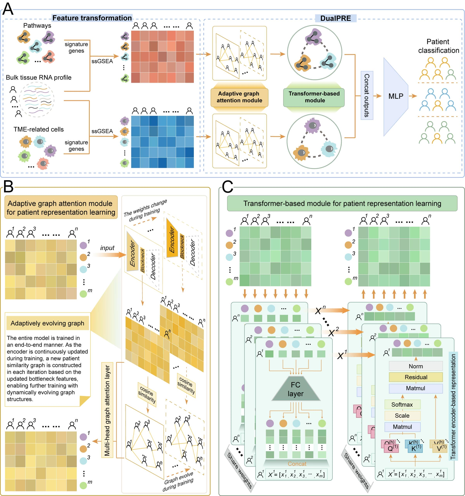

# DualPRE: A dual-view and dual-level patient representation learning framework for precision oncology
-----------------------------------------------------------------
Code by **Jiashuo Wu** at Harbin Medical University.

## 1. Introduction
>This repository contains source code and data for **DualPRE** 

**DualPRE** is a Dual-View and Dual-Level Patient REpresentation framework designed to learn comprehensive patient representations for diverse oncological prediction tasks. DualPRE employs a dual-channel architecture to 
dynamically model two distinct biological views: the tumor's intrinsic signals and its extrinsic microenvironment. Each channel processes a specific data modality, pathway activities or TME cell infiltration levels, and integrates two core learning modules: an Adaptive Graph Attention (**AGAT**) module, which captures adaptively evolving inter-patient similarities at the population level, and a Transformer-based (**TRAN**) module, which models intra-patient molecular interactions at the individual level. This dual-level design embeds both pathway and TME information into patient representations at two complementary scales. The resulting representations are then concatenated and passed to a multilayer perceptron (MLP) for oncological prediction tasks.

* **Note:** 
The **AGAT** module does not rely on a fixed network during training. Instead, it generates an adaptively evolving patient similarity network (PSN) that is continuously updated throughout the training process based on the model's prediction objective, enabling more effective GAT learning and informative patient representations. The **TRAN** module takes each single patient as input for a transformer encoder and models the crosstalk between features while preserving patient-specific information, thereby generating more personalized representations for each patient.

## 2. Design of DualPRE



Figure 1: Overall architecture of DualPRE

## 3. Environment set up

* Python (version 3.8.16)
* Anaconda
    * Relevant information for installing Anaconda can be found in: https://docs.conda.io/projects/conda/en/latest/user-guide/install/.

    * After installing Anaconda, you can create a virtual environment named DualPRE and install the required packages based on the ``environment.yml`` file using the following command:
    ```
    conda env create -f environment.yml
    ```
* PyTorch
    > Depending on the specific machine, PyTorch needs to be installed separately. The installation command line can be found in https://pytorch.org/.

    * For a **LINUX machine without GPUs**, run the following command line:
    ```
    conda install pytorch torchvision cpuonly -c pytorch
    ```
    * For a **LINUX-based GPU server** with **CUDA version 10.x**, run the following command line:
    ```angular2
    conda install pytorch torchvision cudatoolkit=10.x -c pytorch
    ```

## 4. Usage

This study trained four different models to verify the performance of DualPRE. This GitHub project includes the code and data used for training the models and performing the analyses in this study.

### 4.1. Code
All the code files are stored in the ``code/`` folder, with the details of each file as follows:

| File                              | Description                                                                   |
|------------------------------------|------------------------------------------------------------------------|
| layers.py                             | Graph attention layer and the self-attention layer.                            |
| model.py                          | The model framework of DualPRE. |
| trainer.py                            | The function of train and test.                              |
| utils.py  | Other functions, such as the definition of loss functions and data loading.                                       |
| Train_cancerdetection.ipynb                 | Training the cancer detection model and performing external testing.                             |
| Train_BRCAsubtypes.ipynb                              | Training the model of predicting breast cancer subtype and performing external testing.          |
| Train_CRCsubtypes.ipynb                           | Training the model of predicting colorectal cancer subtype and performing external testing.             |
| Train_survival.ipynb                           | Training the model of predicting prognostic risk and performing external testing.             |
| model_interpret.ipynb                           | Extract the PSN, attention weights, and new features from the trained model.             |


* Users who want to reproduce the models from this study only need to activate the Python environment configured in Step 3 and then run the corresponding Train_*.ipynb files. These files contain several tunable parameters. When users want to train a new model, they only need to use their own data and modify these parameters accordingly:

    * ``--task``：The name of the task.
    * ``--epochs``:  The number of training iterations.
    * ``--batch_size``:       The number of samples per batch.
    * ``--dropout_rate``:  Dropout rate value.
    * ``--ntype``:  The number of patient classification.
    * ``--d_k``:  The feature dimensions of matrices Q and K in the self-attention layer.
    * ``--nheads``:  The number of attention heads.
    * ``--nOutputGAT_p``: Feature dimension output by the graph attention layer in the pathway channel
    * ``--nOutputGAT_c``: Feature dimension output by the graph attention layer in the cell channel
    * ``--adp_hidden_dims``: Hidden layer dimensions of the pathway channel autoencoder
    * ``--adp_code_dim``: Bottleneck layer dimension of the pathway channel autoencoder

    * ``--adc_hidden_dims``: Hidden layer dimensions of the cell channel autoencoder

    * ``--adc_code_dim``: Bottleneck layer dimension of the cell channel autoencoder

    * ``--gain``: Scaling factor used in Xavier initialization

    * ``--code_dropout``: Whether to enable the dropout layer

    * ``--alpha``: Negative slope of the LeakyReLU activation function

    * ``--pgraph_k``: Average number of one-hop neighbors per node in the PSN of the pathway channel
    * ``--cgraph_k``: Average number of one-hop neighbors per node in the PSN of the cell channel
    * ``--fm``: Name of the feature matrix file
    * ``--ss``: Name of the patient label file
    * ``--datapath``: Path where training and validation data are stored
    * ``--patience``: Patience value for early stopping
    * ``--early_stop_delta``: Minimum change threshold to determine improvement in model performance
    * ``--gamma``: Decay factor for dynamic learning rate adjustment
    * ``--step_size``: Number of epochs between each learning rate update
    * ``--num_folds``: Number of cross-validation folds
    * ``--save``: Whether to save the training and validation sets for each cross-validation fold
    * ``--drop_last``: Whether to drop the last batch if its size is smaller than batch_size


### 4.2 Data
The datasets used to train and test different models can be downloaded from the ``data.7z`` link:
[Click here to download data.7z from google drive.](https://drive.google.com/file/d/1mrvfu5z3tjuhX5qUfqJe_5SyAvkS6EbK/view) The structure of this folder is as follows:


    data/
    ├── cancerdetection/                                      # For cancer detection task
    │   ├── Pancancer_disease_exp.csv                           # Training features
    │   ├── Pancancer_disease_label.csv                         # Training labels
    │   ├── GDC CPTAC-3_disease_exp.csv                         # Test features
    │   └── GDC CPTAC-3_disease_label.csv                       # Test labels
    ├── BRCAsubtype/                                          # For BRCA subtype prediction
    │   ├── metabric_term.csv                                   # Training features
    │   ├── metabric_clinical_4subtype.csv                      # Training labels
    │   ├── BRCA_term.csv                                       # Test features
    │   └── BRCA_clinical_4subtype.csv                          # Test labels
    ├── CRCsubtype/                                           # For CRC subtype prediction
    │   ├── CRC_geo.csv                                         # Training features
    │   ├── CRC_label_geo.csv                                   # Training labels
    │   ├── COAD_term.csv                                       # Test features
    │   └── CRC_label_coad.csv                                  # Test labels
    └── survival/                                             # For survival risk prediction
        ├── Pancancer_Survival_exp.csv                          # Training features
        ├── Pancancer_Survival_label.csv                        # Training labels
        ├── GDC CPTAC-3_Surv_exp.csv                            # Test features
        └── GDC CPTAC-3_Surv_label.csv                          # Test labels


## 5. Model interpretion
From the trained model, we can obtain the evolved PSN. In addition, we can extract the attention weights between different features as well as the optimized new patient representations. The code for extracting this information for different models is provided in the file ``model_interpret.ipynb`` which located at folder ``code/``.


        


